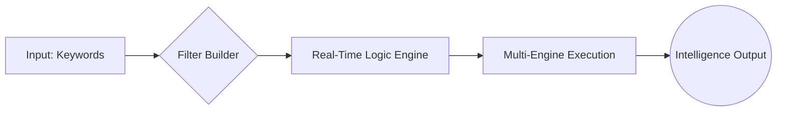

<p align="center">
  
</p>

<p align="center">
  
</p>

<p align="center">
  
  
  
  
</p>

<p align="center">
  
</p>


## 🚀 Overview
**Shimba's Cyber Intelligence Dashboard** is a world-class, single-file OSINT (Open Source Intelligence) and Dorking ecosystem. Designed for security researchers, penetration testers, and OSINT enthusiasts, this tool transforms complex search operators into a high-speed, visual command center.

> [!IMPORTANT]
> **LEGAL DISCLAIMER:** This suite is built strictly for Educational & Defensive Research purposes. Unauthorized use against systems you do not own is illegal.

---

## 💎 Core Architecture (Mental Model)

The dashboard operates on a **Linear Intelligence Pipeline**:



1.  **Input Layer**: Accepts raw keywords and phrases.
2.  **Logic Layer**: Injects advanced operators (`intitle`, `inurl`, `filetype`) dynamically.
3.  **Transport Layer**: Bridges to Google, Bing, or DuckDuckGo.
4.  **History/Persistence**: LocalStorage-based memory to track recon paths.


## 🛠️ Feature Deep-Dive

### 1️⃣ Advanced Dorking Engine
*   **Dynamic Filter Builder**: Add unlimited operators without typing a single colon.
*   **Phrase Control**: Toggle between Normal and Exact (`"..."`) matching instantly.
*   **Filetype Matrix**: One-click selection for PDF, SQL, ENV, LOG, and more.
*   **Real-Time Preview**: Watch your query build line-by-line with syntax highlighting.

### 2️⃣ OSINT Command Center
The suite integrates specialized reconnaissance modules:
*   **Social Media**: Targeted deep-dives into LinkedIn, GitHub, Twitter/X, and Reddit.
*   **Archive Intel**: Bypass paywalls and view deleted content via Wayback Machine and 12ft.io.
*   **Infrastructure Recon**: Shodan integration for IoT, WHOIS lookups, and DNS mapping.

### 3️⃣ The "Cheat Sheet" Vault
A pre-loaded library of lethal dorks and commands:
| Category | Purpose | Example Operator |
| :--- | :--- | :--- |
| 🕵️ **Footholds** | Finding open directories | `intitle:"index of" "parent directory"` |
| 🔑 **Credentials** | Finding exposed passwords | `filetype:env "DB_PASSWORD"` |
| 💻 **SysAdmin** | Network/Bash audit | `ss -tulpn` |
| 🛡️ **Bypass** | Paywall/JS removal | `Google Cache + &strip=1` |

---

## 🔍 Code Deep-Dive: The Logic Engine

```javascript
// The heart of the Query Builder
function bldQ() {
  const p = [], kw = $("kwI").value.trim();
  if (kw) p.push($("pS").value === "exact" ? `"${kw}"` : kw);
  
  S.filters.forEach((f) => {
    if (!f.val.trim()) return;
    // Handles special cases like OR and Exclusions
    if (f.op === "exclude") p.push(`-${f.val}`);
    else if (f.op === "or") p.push(`OR ${f.val}`);
    else p.push(`${f.op}:${f.val}`);
  });
  return p.join(" ");
}
```

### 🔍 Line-by-Line Analysis:
*   **Array Aggregation**: Uses a `p` array to collect logic fragments, ensuring clean spacing.
*   **Conditional Logic**: Checks if "Exact Match" is selected to wrap keywords in quotes.
*   **Dynamic Operators**: Maps UI filter IDs directly to Google Dorking syntax.
*   **Join Operation**: Flattens the logic into a URI-ready string.

---

## 💡 Real-Life Analogy
> Imagine you are in a massive library (The Internet) with billions of books. 
> *   **Keywords** are like looking for "History". 
> *   **Dorks** are like asking the librarian for "Only red leather-bound books, published in 1994, located in the restricted basement section."
> **Shimba's Dashboard** is the high-tech tablet that writes that request for you perfectly every time.

---

## 🛡️ Shimba's Security Golden Rules
> [!WARNING]
> 1. **Virtual Machine Rule**: Always test unknown scripts/downloads in a VM.
> 2. **Double Extension Check**: Never trust `report.pdf.exe`.
> 3. **VPN for OSINT**: Always mask your IP during active research.
> 4. **No Real Passwords**: Never enter credentials on a bypassed site.


## 📥 Installation & Usage
1.  **Clone/Download**: Save the code as `index.html`.
2.  **No Server Needed**: Open it directly in any modern browser (Chrome/Brave/Firefox).
3.  **Zero Dependencies**: Works offline (except for the actual search redirects).
4.  **Dark Mode**: Optimized for night-ops with a single-click theme toggle.

---

## 🎯 Learning Challenges
1.  **The Hidden File**: Use the "Index Of" dork to find a public directory containing `.log` files.
2.  **The Social Ghost**: Use the People Search module to find a developer's GitHub and LinkedIn using only their name and city.
3.  **IoT Discovery**: Use the Shodan module to find an open Apache server in a specific country.


<p align="center">
  <b>Shimba's Cyber Intelligence Dashboard v5.1</b><br>
  <i>"In the world of OSINT, the right question is more powerful than the loudest tool."</i>
</p>

<p align="center">
  
</p>
