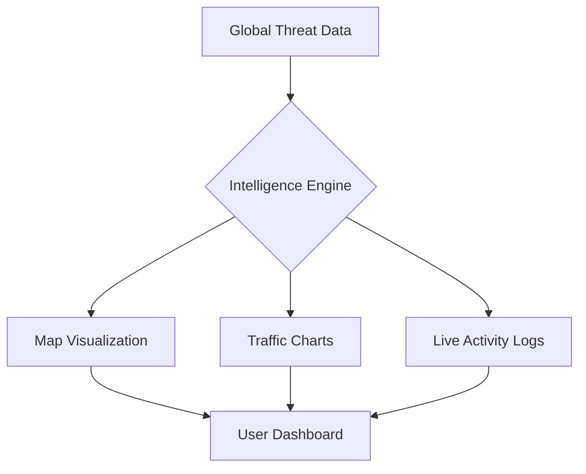

<div align="center">

<!-- Animated Header -->


<!-- Multi-Line Typing SVG -->


<!-- Themed Badges -->
<p align="center">


</p>


</div>

## 🌐 Project Overview: Shimba's Cyber Intelligence Dashboard

**Shimba's Cyber Intelligence Dashboard** ek cutting-edge, real-time security monitoring interface hai. Ye project basically ek **Security Operations Center (SOC)** dashboard ki vibes deta hai, jahan aap global threat levels, attack vectors, aur network traffic ko visualize kar sakte ho ek single window mein.

> [!IMPORTANT]
> **Live Demo:** [Click here to view the Dashboard](https://sudhirdevops1.github.io/Shimba-s-Cyber-Intelligence-Dashboard/)

> [!TIP]
> This dashboard is designed for Cyber Security enthusiasts and Network Administrators who want to see their data in a high-tech, futuristic layout.

---

## 🚀 Key Features

| Feature | Description | Benefit |
| :--- | :--- | :--- |
| **Global Threat Map** | Interactive visualization of attacks happening globally. | Geo-location based threat tracking. |
| **Real-time Metrics** | Live counters for total attacks, blocked threats, and active users. | Instant situational awareness. |
| **Interactive Charts** | Line and Bar charts for traffic analysis. | Deep-dive into historical data trends. |
| **Log Monitor** | A scrolling feed of system events and alerts. | Audit trail for security incidents. |
| **Cyberpunk UI** | Dark-themed, high-contrast interface. | Reduced eye strain for 24/7 monitoring. |

---

## 🛠️ Tech Stack & Architecture

<div align="center">

</div>

### 🏗️ Mental Model: How it Works


---

## 🔍 Technical Deep-Dive

### 1️⃣ The Visualization Layer (Charts)
Project mein **Chart.js** (ya similar library) ka use kiya gaya hai to show:
- **Attack Types:** Pie charts breaking down DDoS, Malware, and Phishing.
- **Network Load:** Real-time line graphs monitoring bandwidth.

### 2️⃣ The Mapping System
Dashboard ek central map use karta hai jo "Hotspots" highlight karta hai. 
- **Red Zones:** High-risk areas.
- **Green Zones:** Secure/Low-activity areas.

### 3️⃣ Responsive Grid System
Layout ko **CSS Grid aur Flexbox** se design kiya gaya hai taki SOC screens se lekar personal laptops tak, sab jagah perfect dikhe.

---

## 🧪 Real-Life Analogy
> "Imagine a **Traffic Police Control Room**. Wahan bade screens pe dikhta hai kahan jam hai, kahan accident hua hai, aur kahan se traffic smooth nikal raha hai. Shimba's Dashboard bilkul wahi hai, bas **Vehicles ki jagah Internet Data Packages** aur **Accidents ki jagah Cyber Attacks** dikhata hai."

---

## 🛠️ Installation & Usage

1. **Clone the Repository:**
   ```bash
   git clone https://github.com/sudhirdevops1/Shimba-s-Cyber-Intelligence-Dashboard.git
   ```
2. **Navigate to Directory:**
   ```bash
   cd Shimba-s-Cyber-Intelligence-Dashboard
   ```
3. **Run Locally:**
   Simply open `index.html` in your favorite browser.

---

## ⚡ Line-by-Line Logic (Simplified)
- **Data Fetching:** Logic is written to simulate or fetch threat feeds.
- **DOM Manipulation:** JavaScript dynamically updates the numbers (Total Attacks) bina page refresh kiye.
- **Event Listeners:** Buttons aur charts interactive hain—hover karne par details milti hain.

---

## 🚧 Roadmap & Future Challenges

> [!WARNING]
> Currently, the data might be simulated for UI/UX purposes. The next step is connecting it to a real-time API.

**Try these challenges to upgrade the project:**
*   **Challenge 1:** Integrate a real-world Cyber Threat API (like AlienVault or ThreatCrowd).
*   **Challenge 2:** Add a "Dark/Light Mode" toggle for different environment preferences.
*   **Challenge 3:** Implement a login system to save specific dashboard layouts for different users.

<div align="center">


### 🤝 Connect with the Developer
**Sudhir DevOps** - *Building the future of Cyber Monitoring.*

[](https://linkedin.com/)
[](https://github.com/sudhirdevops1)

</div>
